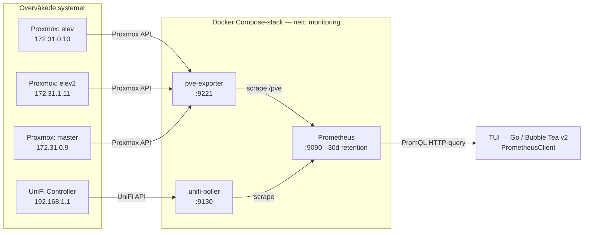
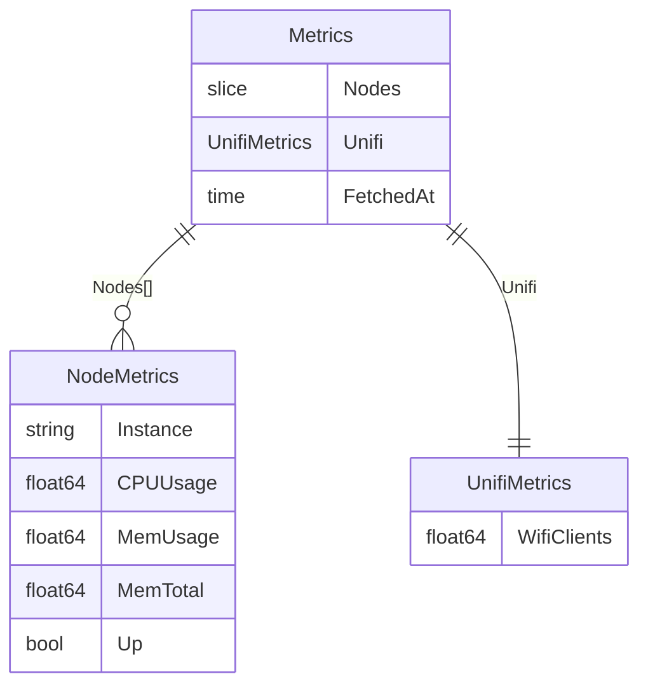

# tui-serverskjerm

Et terminalbasert dashboard (TUI) for overvåkning av et skole-/labmiljø bestående av
Proxmox-noder og UniFi-nettverksutstyr. Prosjektet henter inn metrics via Prometheus
og viser disse direkte i terminalen

## Tech Stack

| Komponent           | Teknologi                                                                            |
| ------------------- | ------------------------------------------------------------------------------------ |
| TUI-rammeverk       | [Bubble Tea v2](https://github.com/charmbracelet/bubbletea) (Go)                     |
| Programmeringsspråk | Go                                                                                   |
| Metrikk-aggregering | [Prometheus](https://prometheus.io/)                                                 |
| Proxmox-eksporter   | [prometheus-pve-exporter](https://github.com/prometheus-pve/prometheus-pve-exporter) |
| UniFi-eksporter     | [UniFi Poller](https://github.com/unpoller/unpoller)                                 |
| Infrastruktur       | Docker / Docker Compose                                                              |

## Arkitektur

Dataflyten går fra de overvåkede systemene (Proxmox-noder og UniFi), via dedikerte
eksportere som oversetter til Prometheus-metrikker, til Prometheus som lagrer og
aggregerer. TUI-en spør Prometheus' HTTP-API og rendrer resultatet i terminalen.



### Metrikker TUI-en spør om

| PromQL-query               | Mappes til                 |
| -------------------------- | -------------------------- |
| `pve_cpu_usage_ratio`      | `NodeMetrics.CPUUsage`     |
| `pve_memory_usage_bytes`   | `NodeMetrics.MemUsage`     |
| `pve_memory_size_bytes`    | `NodeMetrics.MemTotal`     |
| `unifi_clients_wifi_total` | `UnifiMetrics.WifiClients` |

### Datamodell (Go)



Hver `NodeMetrics` identifiseres av Prometheus-labelen `instance`, som settes per
Proxmox-node i `prometheus.yml`.

## Status

### Fungerer

- Go-prosjekt initialisert med Bubble Tea v2
- Grunnleggende TUI-scaffold med tastaturnavigasjon
- Docker Compose-oppsett med datakilde-stack:
  - Prometheus konfigurert med 30 dagers datalagring
  - PVE Exporter koblet mot tre Proxmox-noder (`elev`, `elev2`, `master`)
  - UniFi Poller for nettverksmetrikk

### Gjenstår / planlagt

- [ ] Hente og vise CPU-, RAM- og diskbruk per Proxmox-node
- [ ] Oversikt over kjørende VM-er og containere per node
- [ ] Nettverksstatus fra UniFi (tilkoblede enheter, trafikk, AP-status)
- [ ] Faktisk dashboard-layout i TUI (paneler, farger, sanntidsoppdatering)

## Kjøring

### Forutsetninger

- [Go 1.21+](https://go.dev/dl/)
- [Docker](https://docs.docker.com/get-docker/) og Docker Compose

### Start datakilde-stacken

```bash
cp pve-exporter/pve-exporter.yml.example pve-exporter/pve-exporter.yml
# Fyll inn kredentialer i pve-exporter.yml

docker compose up -d
```
